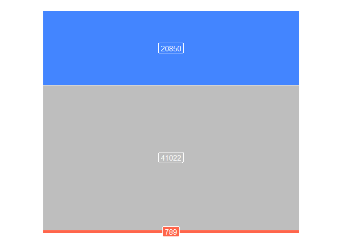
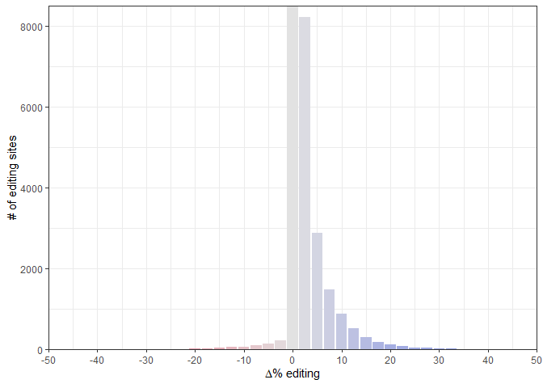
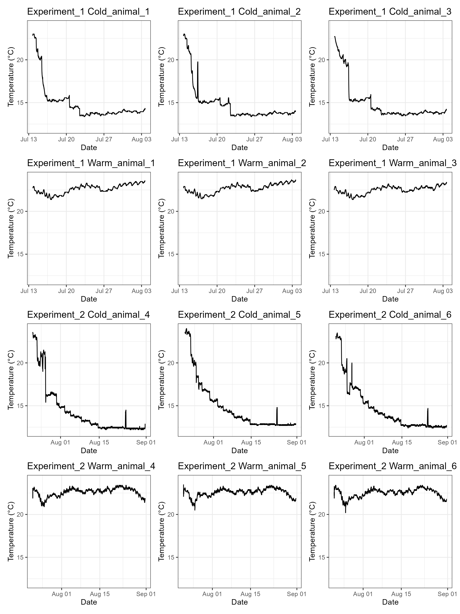

# Temperature dependent RNA editing

[](https://doi.org/10.1016/j.cell.2023.05.004)

This repository is a fork of the repository published with [“Temperature-dependent RNA editing in octopus extensively recodes the neural proteome” by Birk et al](https://www.sciencedirect.com/science/article/pii/S0092867423005238?via%3Dihub). This fork contains a rewritten README and some additional minor modifications as part of a learning exercise for BIFX 572 at Hood College. Most figures in the paper can be reproduced here.

## Figures

Figure 1 displays subfigures illustrating the effect of exposure to cold temperatures on RNA editing activity in octopuses. Octopus drawings in panel A were reproduced, with permission, from Roger Hall and not included in this README.





Figure S1 also goes with these figures.

```{=html}

```